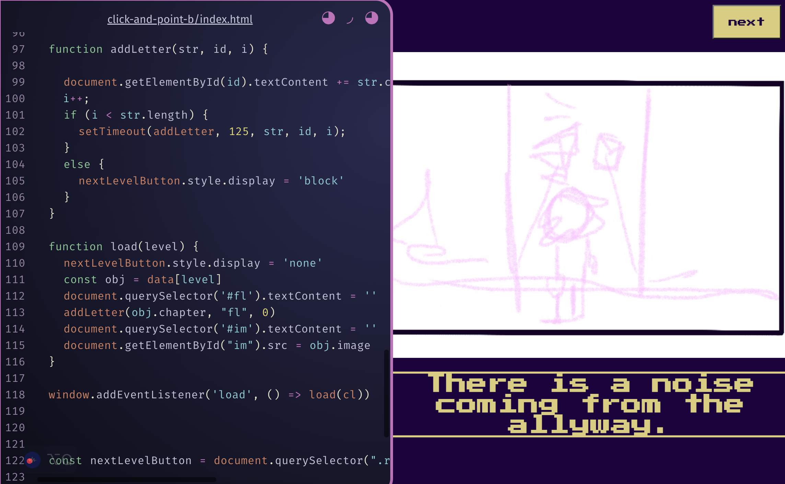

# click-and-point-b

[link to project](https://beckaseifert.github.io/click-and-point-b/)

Part two of the three viewpoints for the Click and Point project/game. This one uses arrays to load an image, along with text in a border that is animated to type out the text letter by letter. I also uses eventListener() to load the first set in the array, and then use that datat to pop up a button to take you to the next object in the array. A plus is that the button does not appear until the text is all done animating.
